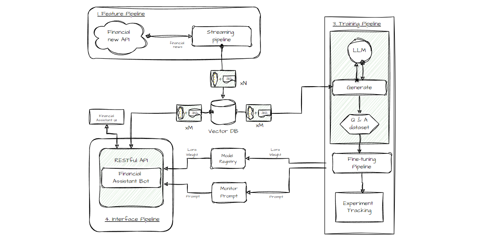

# Real-Time Financial Advisor <div align="center">


<div align="center">
  
</div>

  
## Table of Contents

- [1. Building Blocks](#1-building-blocks)
  - [1.1. Training Pipeline](#11-training-pipeline)
  - [1.2. Streaming Real-time Pipeline](#12-streaming-real-time-pipeline)
  - [1.3. Inference Pipeline](#13-inference-pipeline)
  - [1.4. Financial Q&A Dataset](#14-financial-qa-dataset)
- [2. Setup External Services](#2-setup-external-services)
  - [2.1. Alpaca](#21-alpaca)
  - [2.2. Qdrant](#22-qdrant)
  - [2.3. Comet ML](#23-comet-ml)
  - [2.4. Beam](#24-beam)
  - [2.5. AWS](#25-aws)
- [3. Install & Usage](#3-install--usage)

---

## 1. Building Blocks

Using the 3-pipeline design ↓

### 1.1. Training Pipeline

Training pipeline that:

- loads a proprietary Q&A dataset
- fine-tunes an open-source LLM using QLoRA
- logs the training experiments on [Comet ML's](https://www.comet.com?utm_source=thepauls&utm_medium=partner&utm_content=github) experiment tracker & the inference results on [Comet ML's](https://www.comet.com?utm_source=thepauls&utm_medium=partner&utm_content=github) LLMOps dashboard
- stores the best model on [Comet ML's](https://www.comet.com/site/products/llmops/?utm_source=thepauls&utm_medium=partner&utm_content=github) model registry

The **training pipeline** is **deployed** using [Beam](https://docs.beam.cloud/getting-started/quickstart?utm_source=thepauls&utm_medium=partner&utm_content=github) as a serverless GPU infrastructure.

-> Found under the `modules/training_pipeline` directory.

<details open>
  <summary>Structur folder training pipeline</summary><br>

```
modules/
├── training_pipeline/
│ ├── .beamignore
│ ├── .env.example
│ ├── Makefile
│ ├── README.md
│ ├── logging.yaml
│ ├── poetry.lock
│ ├── pyproject.toml
│ ├── requirements.txt
│ └── tools/

```

  We can create an [Anyscale Workspace](https://docs.anyscale.com/develop/workspaces/get-started) using the [webpage UI](https://console.anyscale.com/o/madewithml/workspaces/add/blank).

  ```md
  - Workspace name: `madewithml`
  - Project: `madewithml`
  - Cluster environment name: `madewithml-cluster-env`
  # Toggle `Select from saved configurations`
  - Compute config: `madewithml-cluster-compute-g5.4xlarge`
  ```

  > Alternatively, we can use the [CLI](https://docs.anyscale.com/reference/anyscale-cli) to create the workspace via `anyscale workspace create ...`

</details>

#### 💻 Minimum Hardware Requirements

- CPU: 4 Cores
- RAM: 14 GiB
- VRAM: 10 GiB (mandatory CUDA-enabled Nvidia GPU)

**Note:** Do not worry if you don't have the minimum hardware requirements. We will show you how to deploy the training pipeline to [Beam's](https://docs.beam.cloud/getting-started/quickstart?utm_source=thepauls&utm_medium=partner&utm_content=github) serverless infrastructure and train the LLM there.

### 1.2. Streaming Real-time Pipeline

Real-time feature pipeline that:

- ingests financial news from [Alpaca](https://alpaca.markets/docs/api-references/market-data-api/news-data/)
- cleans & transforms the news documents into embeddings in real-time using [Bytewax](https://github.com/bytewax/bytewax?utm_source=thepauls&utm_medium=partner&utm_content=github)
- stores the embeddings into the [Qdrant Vector DB](https://qdrant.tech/?utm_source=thepauls&utm_medium=partner&utm_content=github)

The **streaming pipeline** is **automatically deployed** on an AWS EC2 machine using a CI/CD pipeline built in GitHub actions.

-> Found under the `modules/streaming_pipeline` directory.

#### 💻 Minimum Hardware Requirements

- CPU: 1 Core
- RAM: 2 GiB
- VRAM: -

### 1.3. Inference Pipeline

Inference pipeline that uses [LangChain](https://github.com/langchain-ai/langchain) to create a chain that:

- downloads the fine-tuned model from [Comet's](https://www.comet.com?utm_source=thepauls&utm_medium=partner&utm_content=github) model registry
- takes user questions as input
- queries the [Qdrant Vector DB](https://qdrant.tech/?utm_source=thepauls&utm_medium=partner&utm_content=github) and enhances the prompt with related financial news
- calls the fine-tuned LLM for financial advice using the initial query, the context from the vector DB, and the chat history
- persists the chat history into memory
- logs the prompt & answer into [Comet ML's](https://www.comet.com/site/products/llmops/?utm_source=thepauls&utm_medium=partner&utm_content=github) LLMOps monitoring feature

The **inference pipeline** is **deployed** using [Beam](https://docs.beam.cloud/deployment/rest-api?utm_source=thepauls&utm_medium=partner&utm_content=github) as a serverless GPU infrastructure, as a RESTful API. Also, it is wrapped under a UI for demo purposes, implemented in [Gradio](https://www.gradio.app/).

-> Found under the `modules/financial_bot` directory.

<details open>
  <summary>Structur folder Inference Pipeline</summary><br>

```
modules/
├── financial_bot/
│ ├── financial_bot /
│ |   ├─ __init__.py
│ |   ├─ base.py
│ |   ├─ chains.py
│ |   ├─ constants.py
│ |   ├─ embedings.py
│ |   ├─ handlers.py
│ |   ├─ langchain_bot.py
│ |   ├─ models.py
│ |   ├─ qdrant.py
│ |   ├─ templete.py
│ |   └─ utils.py
│ ├── tools/
│ |   ├─ bot.py
│ |   └─ ui.py
│ ├── .beamignore
│ ├── .env.example
│ ├── Makefile
│ ├── README.md
│ ├── logging.yaml
│ ├── poetry.lock
│ ├── pyproject.toml
│ └── requirements.txt

```

#### 💻 Minimum Hardware Requirements

- CPU: 4 Cores
- RAM: 14 GiB
- VRAM: 8 GiB (mandatory CUDA-enabled Nvidia GPU)

**Note:** Do not worry if you don't have the minimum hardware requirements. We will show you how to deploy the inference pipeline to [Beam's](https://docs.beam.cloud/getting-started/quickstart?utm_source=thepauls&utm_medium=partner&utm_content=github) serverless infrastructure and call the LLM from there.

<br/>



#### 1.4. Financial Q&A Dataset

We used `GPT3.5` to generate a financial Q&A dataset to fine-tune our open-source LLM to specialize in using financial terms and answering financial questions. Using a large LLM, such as `GPT3.5` to generate a dataset that trains a smaller LLM (e.g., Falcon 7B) is known as **fine-tuning with distillation**.

## 2. Setup External Services

Before diving into the modules, you have to set up a couple of additional external tools for the course.

**NOTE:** You can set them up as you go for every module, as we will point you in every module what you need.

### 2.1. Alpaca

`financial news data source`

Follow this [document](https://alpaca.markets/docs/market-data/getting-started/) to show you how to create a FREE account and generate the API Keys you will need within this course.

**Note:** 1x Alpaca data connection is FREE.

### 2.2. Qdrant

`serverless vector DB`

Go to [Qdrant](https://qdrant.tech/?utm_source=thepauls&utm_medium=partner&utm_content=github) and create a FREE account.

After, follow [this document](https://qdrant.tech/documentation/cloud/authentication/?utm_source=thepauls&utm_medium=partner&utm_content=github) on how to generate the API Keys you will need within this course.

**Note:** We will use only Qdrant's freemium plan.

### 2.3. Comet ML

`serverless ML platform`

Go to [Comet ML](https://www.comet.com/signup?utm_source=thepauls&utm_medium=partner&utm_content=github) and create a FREE account.

After, [follow this guide](https://www.comet.com/docs/v2/guides/getting-started/quickstart/) to generate an API KEY and a new project, which you will need within the course.

**Note:** We will use only Comet ML's freemium plan.

### 2.4. Beam

`serverless GPU compute | training & inference pipelines`

Go to [Beam](https://www.beam.cloud?utm_source=thepauls&utm_medium=partner&utm_content=github) and create a FREE account.

After, you must follow their [installation guide](https://docs.beam.cloud/getting-started/installation?utm_source=thepauls&utm_medium=partner&utm_content=github) to install their CLI & configure it with your Beam credentials.

To read more about Beam, here is an [introduction guide](https://docs.beam.cloud/getting-started/introduction?utm_source=thepauls&utm_medium=partner&utm_content=github).

**Note:** You have ~10 free compute hours. Afterward, you pay only for what you use. If you have an Nvidia GPU >8 GB VRAM & don't want to deploy the training & inference pipelines, using Beam is optional.

#### Troubleshooting

When using Poetry, we had issues locating the Beam CLI inside a Poetry virtual environment. To fix this, after installing Beam, we create a symlink that points to Poetry's binaries, as follows:

```shell
 export COURSE_MODULE_PATH=<your-course-module-path> # e.g., modules/training_pipeline
 cd $COURSE_MODULE_PATH
 export POETRY_ENV_PATH=$(dirname $(dirname $(poetry run which python)))

 ln -s /usr/local/bin/beam ${POETRY_ENV_PATH}/bin/beam
```

### 2.5. AWS

`cloud compute | feature pipeline`

Go to [AWS](https://aws.amazon.com/console/), create an account, and generate a pair of credentials.

After, download and install their [AWS CLI v2.11.22](https://docs.aws.amazon.com/cli/latest/userguide/getting-started-install.html) and [configure it](https://docs.aws.amazon.com/cli/latest/userguide/cli-chap-configure.html) with your credentials.

**Note:** You will pay only for what you use. You will deploy only a `t2.small` EC2 VM, which is only `~$0.023` / hour. If you don't want to deploy the feature pipeline, using AWS is optional.

## 3. Install & Usage

Every module has its dependencies and scripts. In a production setup, every module would have its repository, but in this use case, for learning purposes, we put everything in one place:

Thus, check out the README for every module individually to see how to install & use it:

1. [q_and_a_dataset_generator](/modules/q_and_a_dataset_generator/)
2. [training_pipeline](/modules/training_pipeline/)
3. [streaming_pipeline](/modules/streaming_pipeline/)
4. [inference_pipeline](/modules/financial_bot/)
